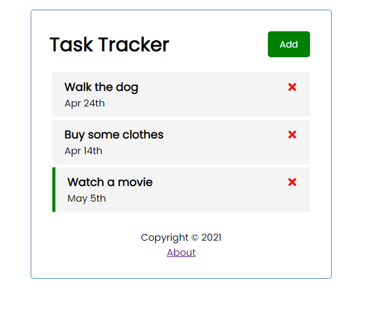
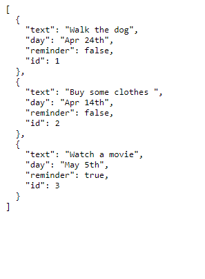

# Task Tracker - React JS

Uma lista de tarefas que permite adicionar o dia e uma tag de lembrete à elas. As tarefas ficam armazenadas em um JSON server, e as requisições são realizadas via fetch API 

# Info

- React JS
- Vídeo de referência [(link)](https://www.youtube.com/watch?v=w7ejDZ8SWv8&t=4800s)

## Rodando a aplicação

- npm start
- npm run server / 

